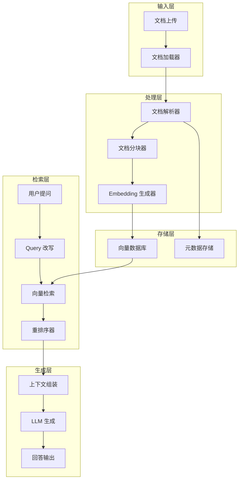

# BinRag 开发路线图

## 系统架构总览



---

## 阶段一：项目初始化与框架选型（1-2天）

**目标：** 搭建项目骨架，确定技术栈

### 任务清单

- [ ] 初始化 Go module，确定项目结构（Clean Architecture）
- [ ] 选型确认：
  - Web 框架：Gin / Fiber
  - 向量数据库：Milvus / Qdrant / Weaviate（推荐 Qdrant，Go SDK 完善）
  - 关系型数据库：PostgreSQL（存元数据）
  - 配置管理：Viper
  - 日志：Zap
  - Embedding 模型：OpenAI / 本地模型（BGE）
  - LLM：OpenAI GPT / 字节豆包
- [ ] 设计目录结构
- [ ] 编写 Makefile / Docker Compose 基础配置

### 推荐项目结构

```
bin-rag/
├── cmd/
│   └── server/          # 入口
├── internal/
│   ├── config/          # 配置
│   ├── loader/          # 文档加载器
│   ├── parser/          # 文档解析器
│   ├── chunker/         # 分块器
│   ├── embedding/       # Embedding 生成
│   ├── vectorstore/     # 向量存储抽象
│   ├── retriever/       # 检索器
│   ├── reranker/        # 重排序
│   ├── llm/             # LLM 客户端
│   ├── rag/             # RAG 编排层
│   └── api/             # HTTP API
├── pkg/
│   └── types/           # 公共类型定义
├── configs/
├── docs/
├── scripts/
└── docker-compose.yml
```

---

## 阶段二：文档加载器（2-3天）

**目标：** 支持多种格式文档的读取

### 任务清单

- [ ] 定义 `Loader` 接口
- [ ] 实现各格式加载器：
  - TXT 纯文本
  - Markdown（保留结构信息）
  - PDF（使用 pdfcpu / unidoc）
  - DOCX（使用 unioffice）
  - CSV / Excel
- [ ] 文档元数据提取（文件名、大小、创建时间、格式）
- [ ] 文件格式自动识别
- [ ] 单元测试

### 核心接口设计

```go
type Document struct {
    ID       string
    Content  string
    Metadata map[string]any
    Source   string
}

type Loader interface {
    Load(ctx context.Context, path string) ([]Document, error)
    SupportedTypes() []string
}
```

---

## 阶段三：文档分块器（2-3天）

**目标：** 将长文档切分为适合 Embedding 的文本块

### 任务清单

- [ ] 定义 `Chunker` 接口
- [ ] 实现分块策略：
  - 固定大小分块（按字符/token）
  - 递归字符分块（按段落 → 句子 → 词逐级拆分）
  - Markdown 结构化分块（按标题层级）
  - 语义分块（基于 Embedding 相似度断句）
- [ ] 分块重叠（overlap）配置
- [ ] Chunk 与源文档的关联关系
- [ ] 单元测试

### 核心接口设计

```go
type Chunk struct {
    ID         string
    Content    string
    DocID      string
    Index      int
    Metadata   map[string]any
}

type ChunkerConfig struct {
    ChunkSize    int
    ChunkOverlap int
    Strategy     string
}

type Chunker interface {
    Split(ctx context.Context, doc Document) ([]Chunk, error)
}
```

---

## 阶段四：Embedding 生成与向量存储（3-4天）

**目标：** 将文本块转为向量并持久化存储

### 任务清单

- [ ] 定义 `Embedder` 接口
- [ ] 实现 Embedding 提供者：
  - OpenAI text-embedding-3-small/large
  - 本地模型（BGE-M3，通过 HTTP 调用）
  - 字节火山引擎 Embedding API
- [ ] 批量 Embedding 生成（带限流/重试）
- [ ] 定义 `VectorStore` 接口
- [ ] 实现向量数据库对接：
  - Qdrant（推荐，Go SDK 好用）
  - 或 Milvus
- [ ] 文档入库 Pipeline（Load → Parse → Chunk → Embed → Store）
- [ ] 单元测试 + 集成测试

### 核心接口设计

```go
type Embedder interface {
    Embed(ctx context.Context, texts []string) ([][]float32, error)
    Dimension() int
}

type VectorStore interface {
    Upsert(ctx context.Context, chunks []Chunk, vectors [][]float32) error
    Search(ctx context.Context, vector []float32, topK int, filter map[string]any) ([]SearchResult, error)
    Delete(ctx context.Context, ids []string) error
}
```

---

## 阶段五：检索器与重排序（2-3天）

**目标：** 实现高质量的文档检索

### 任务清单

- [ ] 基础向量检索（余弦相似度 / 内积）
- [ ] 混合检索：
  - 稀疏检索（BM25 关键词匹配）
  - 稠密检索（向量语义匹配）
  - RRF（Reciprocal Rank Fusion）融合
- [ ] Query 改写 / 扩展（用 LLM 改写用户问题）
- [ ] 重排序（Reranker）：
  - Cross-encoder rerank（调用外部 API）
  - 或简单的 MMR（最大边际相关性）
- [ ] 检索结果过滤（按文档来源、时间等）
- [ ] 单元测试

---

## 阶段六：LLM 集成与 RAG 编排（3-4天）

**目标：** 完成问答生成的核心链路

### 任务清单

- [ ] 定义 `LLM` 接口
- [ ] 实现 LLM 提供者：
  - OpenAI GPT-4 / GPT-4o
  - 字节豆包 / 火山引擎
- [ ] 流式响应支持（SSE）
- [ ] Prompt 模板管理：
  - 系统提示词
  - 上下文注入模板
  - 引用来源标注
- [ ] RAG 编排器：Query → 检索 → 组装 Prompt → LLM → 输出
- [ ] 对话历史管理（多轮对话）
- [ ] 单元测试

### 核心接口设计

```go
type LLM interface {
    Generate(ctx context.Context, messages []Message, opts ...Option) (string, error)
    StreamGenerate(ctx context.Context, messages []Message, opts ...Option) (<-chan string, error)
}

type RAGEngine struct {
    retriever Retriever
    reranker  Reranker
    llm       LLM
    promptTpl *template.Template
}
```

---

## 阶段七：API 层与知识库管理（2-3天）

**目标：** 提供 HTTP API 供前端调用

### 任务清单

- [ ] RESTful API 设计：
  - `POST /api/v1/knowledge-bases` — 创建知识库
  - `POST /api/v1/documents/upload` — 上传文档
  - `GET /api/v1/documents` — 文档列表
  - `DELETE /api/v1/documents/:id` — 删除文档
  - `POST /api/v1/chat` — 问答（支持 SSE 流式）
  - `GET /api/v1/chat/history` — 对话历史
- [ ] 知识库 CRUD
- [ ] 文档上传 → 自动入库异步处理（消息队列 / goroutine pool）
- [ ] 错误处理 & 统一响应格式
- [ ] Swagger 文档
- [ ] 中间件（认证、限流、日志、CORS）

---

## 阶段八：评估与优化（持续）

**目标：** 量化 RAG 效果，持续调优

### 任务清单

- [ ] 构建评估数据集（问题 + 标准答案）
- [ ] 评估指标：
  - 检索命中率（Recall@K）
  - 答案准确性（LLM-as-Judge）
  - 答案忠实度（是否基于检索内容）
- [ ] 分块策略 A/B 测试
- [ ] Embedding 模型对比
- [ ] Prompt 优化迭代

---

## 阶段九（可选）：进阶功能

- [ ] 多租户隔离
- [ ] 权限控制（文档级别）
- [ ] 图片/表格理解（多模态）
- [ ] Agent 工具调用（让 LLM 决定是否需要检索）
- [ ] 知识图谱增强
- [ ] 前端界面（可用 Next.js 快速搭建）

---

## 时间估算

| 阶段 | 预估时间 | 优先级 |
|------|---------|--------|
| 一：框架选型 | 1-2 天 | P0 |
| 二：文档加载器 | 2-3 天 | P0 |
| 三：文档分块器 | 2-3 天 | P0 |
| 四：Embedding + 向量存储 | 3-4 天 | P0 |
| 五：检索 + 重排序 | 2-3 天 | P0 |
| 六：LLM + RAG 编排 | 3-4 天 | P0 |
| 七：API 层 | 2-3 天 | P1 |
| 八：评估优化 | 持续 | P1 |
| 九：进阶功能 | 按需 | P2 |

**核心链路（阶段一到六）预计 2-3 周完成 MVP。**

---

## 技术栈总结

| 组件 | 选型 |
|------|------|
| 语言 | Go 1.22+ |
| Web 框架 | Gin |
| 向量数据库 | Qdrant |
| 关系型数据库 | PostgreSQL |
| Embedding | OpenAI / BGE-M3 |
| LLM | OpenAI GPT-4o / 豆包 |
| 配置 | Viper |
| 日志 | Zap |
| 容器化 | Docker Compose |
| 异步任务 | Asynq (Redis-based) |
