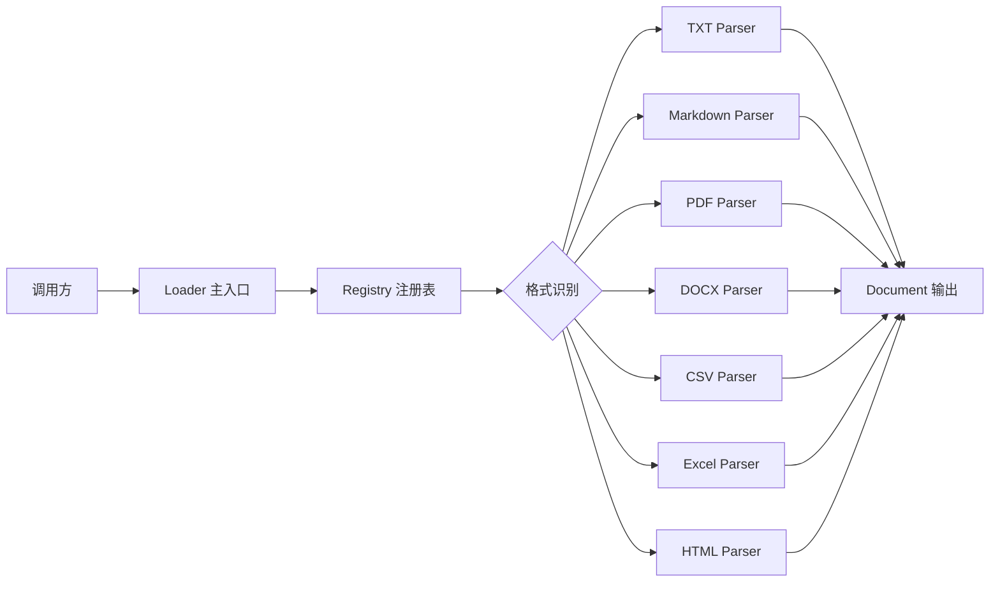
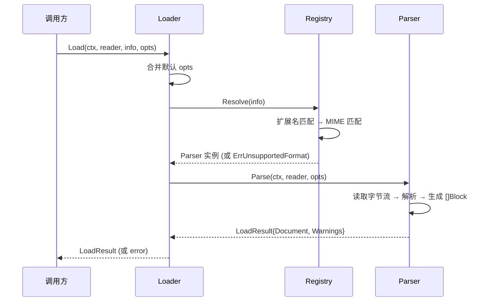

# 文档加载器 Plan

## 架构概览

文档加载器采用**策略模式 + 注册表**架构，三层结构：

1. **Loader 层**（编排）— 接收输入，识别格式，分发给对应 Parser，汇总结果
2. **Registry 层**（路由）— 管理格式与 Parser 的映射关系，支持动态注册
3. **Parser 层**（解析）— 每种格式一个独立实现，遵循统一接口



Loader 本身无状态，Registry 在初始化时构建好后只读访问，Parser 各自独立——天然并发安全。

## 核心数据结构

```go
// 内容块类型
type BlockType int

const (
    BlockParagraph BlockType = iota // 普通段落
    BlockHeading                     // 标题
    BlockListItem                    // 列表项
    BlockCode                        // 代码块
    BlockTable                       // 表格（转为文本）
)

// 内容块 — 文档的最小结构单元
type Block struct {
    Type     BlockType
    Content  string
    Level    int            // 仅标题有效，1-6
    Metadata map[string]any // 扩展字段
}

// 文档 — 加载器的输出
type Document struct {
    Blocks   []Block
    Metadata DocumentMeta
}

type DocumentMeta struct {
    Filename  string
    Format    string
    Size      int64
    Title     string
    PageCount int
    Extra     map[string]any
}

// 文件元信息 — 调用方提供的输入描述
type FileInfo struct {
    Filename string
    MIMEType string
    Size     int64
}

// 加载配置
type LoadOptions struct {
    Mode ErrorMode
}

type ErrorMode int

const (
    ModeTolerant ErrorMode = iota
    ModeStrict
)

// 加载结果
type LoadResult struct {
    Document *Document
    Warnings []string
}
```

## 核心接口

```go
// Parser — 每种格式实现此接口
type Parser interface {
    Parse(ctx context.Context, reader io.Reader, opts LoadOptions) (*LoadResult, error)
    SupportedExts() []string
    SupportedMIMEs() []string
}

// Registry — 管理 Parser 注册与查找
type Registry interface {
    Register(parser Parser)
    Resolve(info FileInfo) (Parser, error)
}

// Loader — 对外主入口
type Loader interface {
    Load(ctx context.Context, reader io.Reader, info FileInfo, opts ...LoadOptions) (*LoadResult, error)
}
```

## 模块设计

### 模块 A：Loader（编排层）

**职责：** 对外统一入口，组合 Registry 和 Parser 完成加载流程
**对外接口：** `Load(ctx, reader, info, opts...) (*LoadResult, error)`
**依赖：** Registry
**实现要点：**
- 构造时注入 Registry 实例
- 合并默认 LoadOptions 与用户传入的配置
- 调用 Registry.Resolve 获取 Parser，再调用 Parser.Parse

### 模块 B：Registry（路由层）

**职责：** 管理格式 → Parser 的映射，支持动态注册和查找
**对外接口：** `Register(parser)` / `Resolve(info) (Parser, error)`
**依赖：** 无
**实现要点：**
- 内部维护两个 map：`extMap[string]Parser` 和 `mimeMap[string]Parser`
- Register 时从 Parser 的 SupportedExts / SupportedMIMEs 提取 key 写入 map
- Resolve 优先用扩展名匹配，无结果时降级 MIME 匹配，都无则返回 `ErrUnsupportedFormat`

### 模块 C：Parsers（解析层）

| Parser | 三方库 | 说明 |
|--------|--------|------|
| TXT | 无（标准库） | 按换行拆段落 |
| Markdown | goldmark | AST 遍历提取标题/段落/列表/代码块 |
| PDF | pdfcpu 或 ledongit/pdf | 逐页提取文本 |
| DOCX | fumiama/go-docx | 遍历段落和样式 |
| CSV | encoding/csv（标准库） | 每行转为一个段落块 |
| Excel | excelize | 逐 sheet 逐行读取 |
| HTML | golang.org/x/net/html | 遍历 DOM 提取文本节点和标题 |

## 模块交互



## 文件组织

```
internal/loader/
├── types.go          — Block、Document、DocumentMeta、FileInfo、LoadOptions 等类型定义
├── parser.go         — Parser 接口定义
├── registry.go       — Registry 接口 + 默认实现 defaultRegistry
├── loader.go         — Loader 接口 + 默认实现 defaultLoader
├── errors.go         — ErrUnsupportedFormat 等错误定义
├── parsers/
│   ├── txt.go        — TXT 解析器
│   ├── markdown.go   — Markdown 解析器
│   ├── pdf.go        — PDF 解析器
│   ├── docx.go       — DOCX 解析器
│   ├── csv.go        — CSV 解析器
│   ├── excel.go      — Excel 解析器
│   └── html.go       — HTML 解析器
└── loader_test.go    — 集成测试（含各格式单元测试）
```

## 技术决策

| 决策点 | 选择 | 理由 |
|--------|------|------|
| Parser 接口粒度 | 每种格式一个独立 Parser | 职责单一，新增格式零侵入，可独立测试 |
| 格式识别策略 | 扩展名优先，MIME 降级 | 扩展名最快且覆盖 90% 场景，MIME 兜底 |
| Registry 并发模型 | 初始化时写入，运行时只读 | 无需加锁，天然并发安全 |
| Markdown 解析库 | goldmark | Go 生态最活跃，纯 Go，支持 AST 遍历 |
| PDF 解析库 | ledongit/pdf 或 pdfcpu | 纯 Go 无 CGO |
| DOCX 解析库 | fumiama/go-docx | 纯 Go，支持段落样式读取 |
| Excel 解析库 | excelize | Go 生态事实标准 |
| HTML 解析库 | golang.org/x/net/html | 官方扩展库，稳定可靠 |
| 错误处理模式 | 选项模式（默认宽容） | 企业文档质量参差，默认不阻塞 |
| 包结构 | internal/loader/ + parsers/ 子目录 | 对外只暴露接口，实现细节不泄露 |
| 测试策略 | bytes.Reader 内存数据源 | 不依赖文件系统，CI 可移植 |
