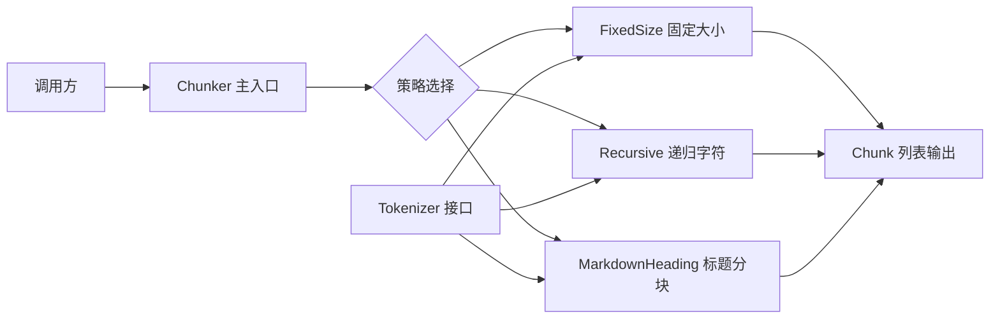
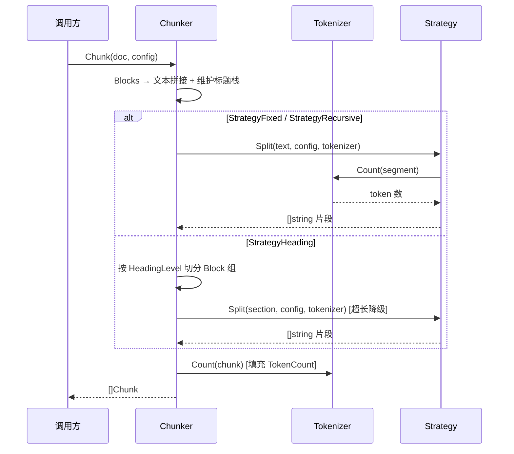

# 文档分块器 Plan

## 架构概览

分块器采用**策略模式**架构：

1. **Chunker 层**（编排）— 接收 `*Document` + 配置，调用 Tokenizer 将 Block 拼接为文本，分发给对应 Strategy
2. **Strategy 层**（策略）— 每种分块策略一个独立实现，负责切分逻辑
3. **Tokenizer 层**（度量）— 提供 token 计数能力，默认使用简单估算器



Chunker 持有 Tokenizer 引用但自身无可变状态，Strategy 是纯函数式处理——天然并发安全。

## 核心数据结构

```go
// Chunk 分块输出
type Chunk struct {
    Content  string
    Index    int
    Metadata ChunkMeta
}

type ChunkMeta struct {
    DocFilename    string
    HeadingContext string
    TokenCount     int
}

// ChunkerConfig 分块配置
type ChunkerConfig struct {
    Strategy     StrategyType
    ChunkSize    int          // 默认 512
    ChunkOverlap int          // 默认 50
    HeadingLevel int          // 默认 2
}

// StrategyType 策略类型枚举
type StrategyType int

const (
    StrategyFixed     StrategyType = iota // 固定大小
    StrategyRecursive                     // 递归字符
    StrategyHeading                       // Markdown 标题
)

// Tokenizer Token 计数接口
type Tokenizer interface {
    Count(text string) int
}

// DefaultTokenizer 简单估算器
type DefaultTokenizer struct{}
```

## 核心接口

```go
// Strategy 分块策略接口
type Strategy interface {
    Split(text string, config ChunkerConfig, tokenizer Tokenizer) []string
}

// Chunker 分块器主接口
type Chunker interface {
    Chunk(doc *loader.Document, config ChunkerConfig) []Chunk
}

// defaultChunker 默认实现
type defaultChunker struct {
    tokenizer  Tokenizer
    strategies map[StrategyType]Strategy
}
```

## 模块设计

### 模块 A：Chunker（编排层）

**职责：** 对外统一入口，将 Document 转为文本并分发给 Strategy
**对外接口：** `Chunk(doc *loader.Document, config ChunkerConfig) []Chunk`
**依赖：** Tokenizer、Strategy
**实现要点：**
- 构造时注入 Tokenizer（默认 DefaultTokenizer）
- 将 Document.Blocks 按类型拼接为文本（Heading 加 "## " 前缀，ListItem 加 "- " 等）
- StrategyFixed / StrategyRecursive：拼接全文后调用 Strategy.Split
- StrategyHeading：特殊路径，直接按 Block 层级切分，不走通用 Split 接口
- 切分结果组装为 Chunk（填充 Index、MetaData、TokenCount）
- 构建 HeadingContext：遍历 Block 时维护标题栈

### 模块 B：FixedSizeStrategy

**职责：** 按固定 token 数切分文本
**实现要点：**
- 按字符逐步累积，用 Tokenizer.Count 计算当前累积文本的 token 数
- 达到 ChunkSize 时切断，回退到最近的空白字符位置
- Overlap：下一个 chunk 从前一个 chunk 末尾回退 overlap token 处开始

### 模块 C：RecursiveStrategy

**职责：** 递归按优先分隔符切分
**实现要点：**
- 分隔符优先级：`["\n\n", "\n", "。", "！", "？", ".", "!", "?", " ", ""]`
- 先按最高优先级分隔符拆分段落
- 如果某段仍超过 ChunkSize，用下一级分隔符继续拆
- 最终保证每个 chunk ≤ ChunkSize token
- Overlap 同固定大小策略

### 模块 D：HeadingStrategy

**职责：** 按 Markdown 标题层级切分
**实现要点：**
- 直接操作 Block 列表（不走通用 Split 接口）
- 按配置的 HeadingLevel 扫描 Block，遇到该层级的 Heading 即开始新的 Chunk
- 如果单个标题节内容超过 ChunkSize，降级使用 RecursiveStrategy 再拆
- 每个 Chunk 的 HeadingContext 记录标题路径（父标题 > 当前标题）

### 模块 E：DefaultTokenizer

**职责：** 简单 token 数估算
**实现要点：**
- 遍历 rune：中文字符（unicode.Is(unicode.Han, r)）计 2 token，ASCII 空格分词后每词计 1 token
- 标点符号计 1 token
- 不引入任何外部依赖

## 模块交互



## 文件组织

```
internal/chunker/
├── types.go              — Chunk、ChunkMeta、ChunkerConfig、StrategyType 等类型定义
├── tokenizer.go          — Tokenizer 接口 + DefaultTokenizer 实现
├── strategy.go           — Strategy 接口定义
├── strategy_fixed.go     — FixedSizeStrategy 实现
├── strategy_recursive.go — RecursiveStrategy 实现
├── strategy_heading.go   — HeadingStrategy 实现
├── chunker.go            — Chunker 接口 + defaultChunker 实现 + NewChunker 工厂
└── chunker_test.go       — 全策略测试
```

## 技术决策

| 决策点 | 选择 | 理由 |
|--------|------|------|
| 分块度量单位 | Token 数 | 贴近 Embedding 模型实际消耗 |
| 默认 Tokenizer | 简单估算器（中文字符×2，英文按词） | 零依赖可用，精确实现由调用方注入 |
| 重叠策略 | 固定 token 数 | 实现简单、可控，业界主流做法 |
| 递归分隔符顺序 | 段落→句子→词 | 优先在语义自然边界切分 |
| HeadingStrategy 超长降级 | 降级到 RecursiveStrategy | 保证每个 Chunk 不超限，复用已有逻辑 |
| Strategy 接口设计 | Split(text, config, tokenizer) []string | 策略只做文本切分，不感知 Document 结构 |
| HeadingStrategy 特殊路径 | 直接操作 Block 列表 | 需感知标题层级，无法退化为纯文本切分 |
| 标题上下文追踪 | Chunker 层维护标题栈 | 编排层统一处理，Strategy 无需关心 |
| Block → 文本拼接规则 | Heading 加 "## " 前缀，ListItem 加 "- " | 保留可读性 |
| 包位置 | internal/chunker/ | 与 loader 平级 |
| 默认参数 | ChunkSize=512, Overlap=50, HeadingLevel=2 | 业界常用默认值 |
