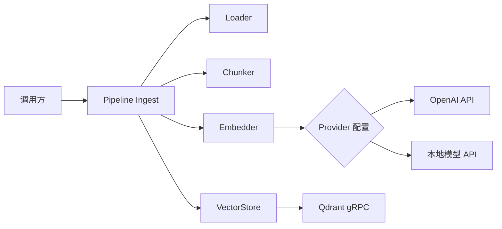
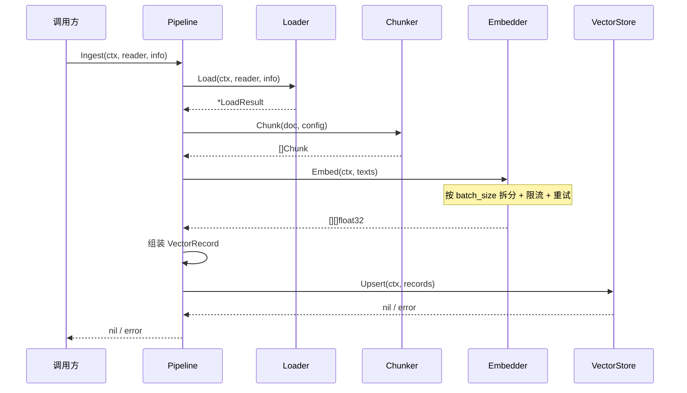

# Embedding 与向量存储 Plan

## 架构概览



**四层结构：**

1. **Embedder 层** — 统一接口 + 配置化 Provider 选择，内置限流/重试/批量拆分
2. **VectorStore 层** — 统一接口 + Qdrant 实现（gRPC），支持搜索+过滤+批量
3. **Pipeline 层** — 编排 Load → Chunk → Embed → Store 完整流程
4. **Config 层** — 配置文件驱动所有外部依赖参数

## 核心数据结构

```go
// EmbedderConfig Embedding 提供者配置
type EmbedderConfig struct {
    Provider   string // "openai" / "local"
    APIKey     string
    BaseURL    string
    Model      string
    Dimension  int
    BatchSize  int    // 默认 100
    MaxRetries int    // 默认 3
    QPS        int    // 默认 10
}

// VectorStoreConfig 向量存储配置
type VectorStoreConfig struct {
    Host           string
    CollectionName string
    Dimension      int
    Distance       string // "cosine" / "euclid" / "dot"
}

// VectorRecord 入库记录
type VectorRecord struct {
    ID       string
    Vector   []float32
    Payload  map[string]any
}

// SearchResult 搜索结果
type SearchResult struct {
    ID      string
    Score   float32
    Payload map[string]any
}

// SearchRequest 搜索请求
type SearchRequest struct {
    Vector []float32
    TopK   int
    Filter map[string]any
}

// IngestConfig Pipeline 配置
type IngestConfig struct {
    Embedder    EmbedderConfig
    VectorStore VectorStoreConfig
    Chunker     chunker.ChunkerConfig
}
```

## 核心接口

```go
// Embedder 向量生成接口
type Embedder interface {
    Embed(ctx context.Context, texts []string) ([][]float32, error)
}

// VectorStore 向量存储接口
type VectorStore interface {
    Upsert(ctx context.Context, records []VectorRecord) error
    Search(ctx context.Context, req SearchRequest) ([]SearchResult, error)
    Delete(ctx context.Context, ids []string) error
    EnsureCollection(ctx context.Context) error
}

// Pipeline 文档入库编排
type Pipeline interface {
    Ingest(ctx context.Context, reader io.Reader, info loader.FileInfo) error
}
```

## 模块设计

### 模块 A：Embedder（向量生成层）

**职责：** 将文本转为向量，封装批量/限流/重试逻辑
**对外接口：** `Embed(ctx, texts) ([][]float32, error)`
**依赖：** HTTP Client、配置
**实现要点：**
- `NewEmbedder(config EmbedderConfig) Embedder` 工厂函数
- 只有一套 HTTP 调用逻辑：POST /v1/embeddings，差异仅在 BaseURL/APIKey/Model
- 批量拆分：按 config.BatchSize 将输入 texts 拆为多批
- 限流：golang.org/x/time/rate.Limiter 控制 QPS
- 重试：429 或网络错误时指数退避（1s, 2s, 4s），最多 MaxRetries 次
- 结果按原始顺序拼接返回

### 模块 B：VectorStore — Qdrant 实现

**职责：** 对接 Qdrant gRPC SDK，实现向量 CRUD
**对外接口：** VectorStore 接口全部方法
**依赖：** Qdrant gRPC Client、配置
**实现要点：**
- `NewQdrantStore(config VectorStoreConfig) (VectorStore, error)`
- 构造时建立 gRPC 连接
- `EnsureCollection`：检查 Collection 是否存在，不存在则按 Dimension + Distance 创建
- `Upsert`：VectorRecord → Qdrant PointStruct 批量 upsert
- `Search`：构造 SearchPoints 请求，Filter 条件转为 Qdrant Filter 结构
- `Delete`：按 PointID 批量删除

### 模块 C：Pipeline（编排层）

**职责：** 串联 Load → Chunk → Embed → Store 完整流程
**对外接口：** `Ingest(ctx, reader, info) error`
**依赖：** Loader、Chunker、Embedder、VectorStore
**实现要点：**
- `NewPipeline(loader, chunker, embedder, vectorstore) Pipeline`
- Ingest 执行：Load → Chunk → 提取 texts → Embed → 组装 VectorRecord → Upsert
- VectorRecord Payload 包含：filename、heading_context、chunk_index、content

### 模块 D：Config（配置层）

**职责：** 加载 YAML 配置文件
**实现要点：**
- `LoadConfig(path string) (*Config, error)`
- 配置路径：环境变量 BINRAG_CONFIG 或默认 ./configs/config.yaml
- 使用 gopkg.in/yaml.v3 解析

### 模块 E：Docker Compose

**职责：** 一键启动 Qdrant 依赖
**产出：** docker-compose.yml、configs/config.yaml 模板

## 模块交互



## 文件组织

```
project/
├── docker-compose.yml          — Qdrant 服务定义
├── configs/
│   └── config.yaml             — 项目配置模板
├── internal/
│   ├── config/
│   │   └── config.go           — 配置加载
│   ├── embedding/
│   │   ├── embedder.go         — Embedder 接口 + openaiEmbedder 实现
│   │   └── embedder_test.go    — 单元测试（mock HTTP server）
│   ├── vectorstore/
│   │   ├── types.go            — VectorRecord、SearchResult、SearchRequest
│   │   ├── store.go            — VectorStore 接口定义
│   │   ├── qdrant.go           — Qdrant gRPC 实现
│   │   └── qdrant_test.go      — 集成测试（需 Qdrant 实例）
│   └── pipeline/
│       ├── pipeline.go         — Pipeline 接口 + 实现
│       └── pipeline_test.go    — 单元测试（mock 所有依赖）
├── go.mod
└── go.sum
```

## 技术决策

| 决策点 | 选择 | 理由 |
|--------|------|------|
| Embedding 调用协议 | OpenAI 兼容 API（POST /v1/embeddings） | 一套代码适配多 Provider |
| Provider 区分方式 | 仅 BaseURL + APIKey + Model 不同 | 无需独立实现 |
| 限流实现 | golang.org/x/time/rate.Limiter | 标准库质量，token bucket |
| 重试策略 | 指数退避（1s, 2s, 4s）+ 最多 3 次 | 平衡等待和成功率 |
| 向量数据库 | Qdrant（Docker 部署） | 轻量、Go gRPC SDK 简洁 |
| Qdrant SDK | github.com/qdrant/go-client | 官方维护，gRPC 原生 |
| 向量 ID 生成 | UUID v4 | 全局唯一 |
| Payload 存储 | 文档名 + 标题上下文 + chunk 序号 + 原文 | 搜索结果可直接返回上下文 |
| 配置格式 | YAML | 可读性好 |
| Pipeline 编排 | 同步串行 | 当前阶段够用 |
| 集成测试策略 | Docker Compose + build tag | 单元测试不依赖外部服务 |
| 内存 VectorStore | 不做 | 测试时 mock 接口即可 |
