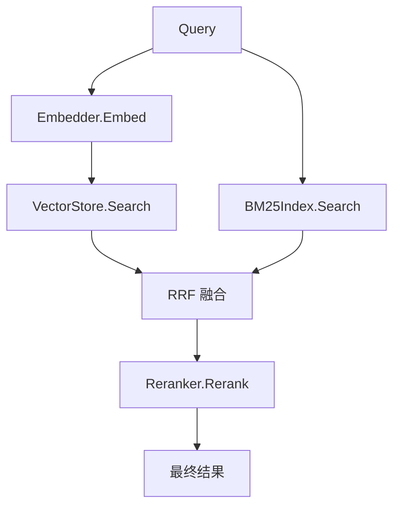

# 检索器与重排序 Plan

## 架构概览

检索层由四个核心组件构成：

1. **BM25Index** — 内存倒排索引，负责关键词检索和 BM25 打分
2. **Retriever** — 检索编排器，协调向量检索和 BM25 检索，执行 RRF 融合
3. **Reranker** — 重排序器，调用外部 Cross-encoder API 对候选列表重新打分
4. **配置扩展** — 在现有 config 中新增 retriever 和 reranker 段

数据流：



## 核心数据结构

### RetrieveResult

```go
type RetrieveResult struct {
    ID       string
    Content  string
    Score    float32
    Metadata map[string]any
}
```

### RetrieveRequest

```go
type RetrieveRequest struct {
    Query  string
    TopK   int
    Filter map[string]any
}
```

### BM25Doc

```go
type BM25Doc struct {
    ID      string
    Content string
}
```

## 核心接口

### Retriever

```go
type Retriever interface {
    Search(ctx context.Context, req RetrieveRequest) ([]RetrieveResult, error)
}
```

### BM25Index

```go
type BM25Index interface {
    Add(id string, content string)
    Remove(id string)
    Search(query string, topK int) []BM25Result
    Rebuild(docs []BM25Doc)
    DocCount() int
}

type BM25Result struct {
    ID    string
    Score float32
}
```

### Reranker

```go
type Reranker interface {
    Rerank(ctx context.Context, query string, candidates []RetrieveResult, topN int) ([]RetrieveResult, error)
}
```

### Tokenizer（BM25 分词用）

```go
type Tokenizer interface {
    Tokenize(text string) []string
}
```

## 模块设计

### internal/retriever

**职责：** 检索编排，协调两路召回 + RRF 融合 + 调用 Reranker
**对外接口：** `Retriever` interface, `NewRetriever(cfg, embedder, vectorstore, bm25index, reranker)`
**依赖：** embedding.Embedder, vectorstore.VectorStore, BM25Index, Reranker

核心逻辑：
1. 并发执行向量检索和 BM25 检索（两个 goroutine）
2. 收集两路结果，调用 RRF 融合
3. 若 Reranker 启用，调用 Reranker.Rerank
4. 若 Reranker 禁用或失败，直接返回融合结果

### internal/retriever/bm25.go

**职责：** 内存倒排索引 + BM25 打分算法
**对外接口：** `BM25Index` interface, `NewBM25Index(tokenizer)`
**依赖：** Tokenizer

实现细节：
- 倒排表：`map[term][]posting`，posting 包含 docID 和词频
- 文档长度表：`map[docID]int`（记录每篇文档 token 数）
- BM25 参数：k1=1.2, b=0.75（标准值）
- 读写锁保护并发安全

### internal/retriever/tokenizer.go

**职责：** BM25 分词
**对外接口：** `Tokenizer` interface, `NewSimpleTokenizer()`
**依赖：** 无

分词逻辑：
- 英文：按空格/标点分词，统一小写
- 中文：bigram 切分（两字一组滑动窗口）
- 去除停用词（可选，默认不去）

### internal/reranker

**职责：** Cross-encoder 重排序 API 调用
**对外接口：** `Reranker` interface, `NewReranker(cfg)`
**依赖：** config.RerankerConfig, net/http

API 协议（兼容 /v1/rerank）：
```json
POST /v1/rerank
{
  "model": "bge-reranker-v2-m3",
  "query": "...",
  "documents": ["...", "..."],
  "top_n": 5
}
Response:
{
  "results": [{"index": 0, "relevance_score": 0.95}, ...]
}
```

支持 rate limiting 和 retry（复用 Embedder 的模式）。

### internal/retriever/rrf.go

**职责：** RRF 融合算法
**对外接口：** `FuseRRF(vectorResults, bm25Results, cfg) []RetrieveResult`
**依赖：** 无

公式：`score(d) = vector_weight / (k + rank_vector(d)) + bm25_weight / (k + rank_bm25(d))`

仅出现在一路的文档，另一路 rank 视为 ∞（不贡献分数）。

## 模块交互

```
NewRetriever()
    │
    ▼
Search(ctx, req)
    ├── go: embedder.Embed(query) → vectorstore.Search → vectorResults
    ├── go: bm25Index.Search(query, topK) → bm25Results
    │
    ▼ (等待两路完成)
    FuseRRF(vectorResults, bm25Results, cfg)
    │
    ▼
    reranker.Rerank(query, fusedResults, topN)  [如果启用]
    │
    ▼
    return finalResults
```

Pipeline.Ingest 扩展：入库成功后调用 `bm25Index.Add(id, content)` 更新索引。

## 文件组织

```
internal/
├── retriever/
│   ├── types.go          — RetrieveResult, RetrieveRequest, BM25Result, BM25Doc
│   ├── retriever.go      — Retriever 接口 + defaultRetriever 实现
│   ├── bm25.go           — BM25Index 接口 + defaultBM25Index 实现
│   ├── tokenizer.go      — Tokenizer 接口 + SimpleTokenizer
│   ├── rrf.go            — FuseRRF 函数
│   └── retriever_test.go — 单元测试
├── reranker/
│   ├── reranker.go       — Reranker 接口 + apiReranker 实现
│   └── reranker_test.go  — 单元测试
├── config/
│   └── config.go         — 新增 RetrieverConfig, RerankerConfig
└── pipeline/
    └── pipeline.go       — Ingest 中增加 bm25Index.Add 调用
```

## 技术决策

| 决策点 | 选择 | 理由 |
|--------|------|------|
| BM25 存储 | 内存倒排索引 | 万级 Chunk 规模内存可控，避免引入 ES 等外部依赖 |
| 中文分词 | bigram 滑动窗口 | 实现简单、无第三方依赖，效果优于单字切分 |
| RRF 参数 | k=60, vector_weight=0.7, bm25_weight=0.3 | 业界标准默认值，语义检索权重略高于关键词 |
| Reranker 协议 | 兼容 /v1/rerank | 与 Embedder 配置方式统一，支持多种后端（Jina/Cohere/本地 bge-reranker） |
| 并发模型 | 两路检索并行（goroutine） | 向量检索和 BM25 无依赖关系，并行可降低延迟 |
| 索引重建 | 启动时 Qdrant Scroll 全量拉取 | 利用已有基础设施，无额外存储依赖 |
| 降级策略 | BM25 空→纯向量；Reranker 失败→跳过 | 保证核心检索链路可用 |
