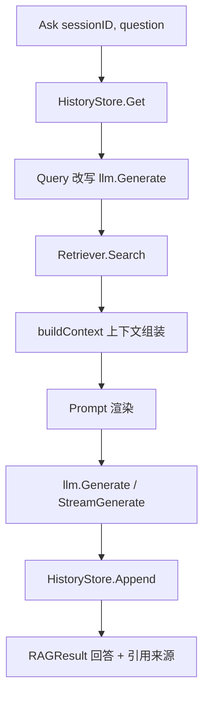

# LLM 集成与 RAG 编排 Plan

## 架构概览

阶段六由两个新包构成，沿用现有「接口 + 默认实现 + OpenAI 兼容客户端」风格：

1. **internal/llm** — LLM 客户端。只做「聊」：普通生成与流式生成，OpenAI 兼容 `/v1/chat/completions`，支持限流与指数退避重试。阶段七 API 层可直接复用。
2. **internal/rag** — RAG 编排层。RAGEngine 串起完整链路：读取对话历史 → Query 改写 → 检索 → 上下文组装 → Prompt 渲染 → LLM 生成 → 落历史 → 返回回答与引用来源。包含 Prompt 模板管理（内置默认 + 文件覆盖）与 HistoryStore（接口 + 内存实现）。

数据流：



## 核心数据结构

### llm.Message

```go
// Message 对话消息
type Message struct {
    Role    string `json:"role"`
    Content string `json:"content"`
}

const (
    RoleSystem    = "system"
    RoleUser      = "user"
    RoleAssistant = "assistant"
)
```

### llm.StreamChunk

```go
// StreamChunk 流式增量片段
type StreamChunk struct {
    Content string // 增量文本（不含前一片段内容）
    Done    bool   // 最后一个片段标记
}
```

### rag.Source / rag.RAGResult

```go
// Source 引用来源
type Source struct {
    ID       string  // 检索片段 ID
    Filename string  // 来源文件名（来自元数据）
    Heading  string  // 标题上下文
    Score    float32 // 检索分数
}

// RAGResult 回答结果
type RAGResult struct {
    Answer  string
    Sources []Source
}
```

### rag.StreamEvent

```go
// StreamEvent 流式 RAG 事件
type StreamEvent struct {
    Type    EventType
    Content string   // EventChunk 时有效
    Sources []Source // EventSources 时有效
    Err     error    // EventError 时有效
}

type EventType int

const (
    EventSources EventType = iota // 引用来源，先发
    EventChunk                    // 文本增量
    EventDone                     // 正常结束
    EventError                    // 出错终止
)
```

## 核心接口

### llm.LLM

```go
// LLM 统一生成接口（OpenAI 兼容）
type LLM interface {
    Generate(ctx context.Context, messages []Message, opts ...ChatOption) (string, error)
    StreamGenerate(ctx context.Context, messages []Message, opts ...ChatOption) (<-chan StreamChunk, error)
}
```

### rag.HistoryStore

```go
// HistoryStore 对话历史存储接口（数据库实现留阶段七）
type HistoryStore interface {
    Append(sessionID string, role string, content string) error
    Get(sessionID string, limit int) ([]llm.Message, error) // 最近 limit 条
    Clear(sessionID string) error
}
```

### rag.Engine

```go
// Engine RAG 编排接口
type Engine interface {
    Ask(ctx context.Context, sessionID string, question string) (*RAGResult, error)
    StreamAsk(ctx context.Context, sessionID string, question string) (<-chan StreamEvent, error)
}
```

## 模块设计

### internal/llm/llm.go

**职责：** LLM 接口 + OpenAI 兼容客户端实现
**对外接口：** `LLM` interface, `NewLLM(cfg config.LLMConfig) LLM`, `ChatOption` 系列
**依赖：** config.LLMConfig, net/http, rate

请求协议（POST {base_url}/v1/chat/completions）：

```json
{
  "model": "gpt-4o",
  "messages": [{"role": "system", "content": "..."}],
  "temperature": 0.7,
  "max_tokens": 2048,
  "stream": false
}
```

实现细节：
- `Generate`：批量请求，rate limiter 限流；网络错误 / 429 / 5xx 指数退避重试（复用 Embedder 的模式，含 `RetryableError` 类型）；4xx 直接失败
- 无 API Key 时省略 Authorization 头（本地模型场景）
- ChatOption：`WithModel`、`WithTemperature`、`WithMaxTokens`，未指定时用配置默认值

### internal/llm/stream.go

**职责：** SSE 流式解析
**对外接口：** `parseSSE(respBody io.Reader, out chan<- StreamChunk)`（内部函数）
**依赖：** 无

实现细节：
- `stream: true` 请求，响应为 `text/event-stream`
- 逐行解析 `data: {...}`，取 `choices[0].delta.content` 作为增量；`data: [DONE]` 时发 `Done` 片段并关闭通道
- **重试策略：** 收到首个 delta 之前失败可重试（限流 + 重建连接）；收到首个 delta 后失败不再重试，直接发错误并关闭通道——避免重复输出

### internal/rag/engine.go

**职责：** RAGEngine 编排
**对外接口：** `Engine` interface, `NewEngine(cfg config.RAGConfig, llm llm.LLM, rt retriever.Retriever, hs HistoryStore) Engine`
**依赖：** llm, retriever, HistoryStore, config.RAGConfig

`Ask` 流程：
1. `history.Get(sessionID, cfg.HistoryLimit)` 取最近历史
2. 若 `EnableRewrite`：`llm.Generate(rewritePrompt(历史, 问题), 低温)` 得到改写查询；改写失败则降级用原问题（日志告警）
3. `retriever.Search({Query: 改写查询, TopK: cfg.TopK})` 检索
4. `buildContext(结果, 预算)` 组装上下文与引用来源
5. 渲染 messages = `[system] + 历史 + [user: 上下文 + 原始问题]`
6. `llm.Generate(messages)` 生成回答
7. 生成成功后 `history.Append(question)` + `history.Append(answer)`；失败不落历史
8. 返回 `{Answer, Sources}`

`StreamAsk` 同流程，但第 6 步走 `llm.StreamGenerate`，事件序列：`EventSources` → `EventChunk`×N → `EventDone`；任一步失败发 `EventError` 并关闭通道。

### internal/rag/prompt.go

**职责：** Prompt 模板管理
**对外接口：** `renderSystem(cfg, 无参)`、`renderContext(items, 模板)`、`renderRewrite(历史, 问题, 模板)`（内部函数）
**依赖：** text/template

- 内置默认模板常量（中文）：

```
系统提示词：你是一个基于企业知识库的问答助手。请严格基于下方检索资料回答；
资料不足时明确回答「未找到相关资料」，不要编造。回答中按 [编号] 标注引用来源。

上下文：以下是检索到的相关资料：
[1]（来源：{filename} / {heading}）
{content}
...

改写：将用户问题改写为自包含、适合检索的独立查询，结合对话历史消解指代。
仅输出改写后的查询本身，不要任何解释。
```

- 模板来源优先级：配置路径文件（SystemPromptPath / ContextTemplatePath / RewriteTemplatePath）> 内置默认
- 文件读取失败或渲染失败 → 降级内置默认模板（日志告警）

### internal/rag/history.go

**职责：** 对话历史存储
**对外接口：** `NewMemoryHistoryStore(capacity int) HistoryStore`
**依赖：** sync

- 内部 `map[string][]llm.Message` + RWMutex
- `Append` 超容量时丢弃最旧消息
- `Get` 返回最近 limit 条（不足返回全部）

### internal/rag/context.go

**职责：** 上下文组装与 token 预算
**对外接口：** `buildContext(chunks []retriever.RetrieveResult, maxTokens int, maxChunks int) (string, []Source)`（内部函数）
**依赖：** retriever

- 按序累加片段 token 数（内置轻量估算：中文字符 2 token、英文按词 1 token，与 chunker 估算一致），超过 `maxTokens` 停止
- 片段数不超过 `maxChunks`
- 同步产出 `[]Source`（从结果 Metadata 提取 filename / heading_context）

## 模块交互

```
NewEngine(cfg, llm, retriever, history)
    │
    ▼
Ask(sessionID, question)
    1. history.Get(sessionID, limit) ──────────────► 最近历史
    2. [EnableRewrite] llm.Generate(改写模板) ─────► 改写查询（失败降级原问题）
    3. retriever.Search(改写查询, topK) ───────────► []RetrieveResult
    4. buildContext(结果, 预算) ───────────────────► context + []Source
    5. 渲染 messages = [system] + 历史 + [user]
    6. llm.Generate(messages) ─────────────────────► answer
    7. history.Append(question) / Append(answer)
    8. return RAGResult{Answer, Sources}
```

依赖方向：`rag → llm`、`rag → retriever`（retriever 已依赖 embedding / vectorstore / reranker）、`rag → config`。无环。

## 文件组织

```
internal/
├── llm/
│   ├── llm.go          — Message、ChatOptions、LLM 接口、openaiLLM 实现（含重试/限流）
│   ├── stream.go       — SSE 流式解析
│   └── llm_test.go     — httptest mock 服务器测试（生成/流式/重试/错误）
├── rag/
│   ├── engine.go       — Engine 接口、RAGEngine、Ask / StreamAsk
│   ├── prompt.go       — 默认模板常量 + 渲染
│   ├── history.go      — HistoryStore 接口 + memoryHistoryStore
│   ├── context.go      — Source 类型、buildContext、token 估算
│   ├── engine_test.go  — 编排链路测试（mock retriever + mock llm）
│   ├── history_test.go — 容量/并发测试
│   ├── prompt_test.go  — 模板渲染测试
│   └── context_test.go — 截断/预算测试
├── config/
│   └── config.go       — 新增 LLMConfig、RAGConfig + 默认值
└── retriever/          — （现有，不动）
```

## 配置扩展

```go
// config.go 新增
type LLMConfig struct {
    BaseURL     string  `yaml:"base_url"`
    APIKey      string  `yaml:"api_key"`
    Model       string  `yaml:"model"`
    Temperature float32 `yaml:"temperature"`
    MaxTokens   int     `yaml:"max_tokens"`
    MaxRetries  int     `yaml:"max_retries"`
    QPS         int     `yaml:"qps"`
    Timeout     int     `yaml:"timeout"` // 秒
}

type RAGConfig struct {
    TopK                 int    `yaml:"top_k"`
    MaxContextTokens     int    `yaml:"max_context_tokens"`
    MaxChunks            int    `yaml:"max_chunks"`
    EnableRewrite        bool   `yaml:"enable_rewrite"`
    HistoryCapacity      int    `yaml:"history_capacity"`
    HistoryLimit         int    `yaml:"history_limit"`
    SystemPromptPath     string `yaml:"system_prompt_path"`
    ContextTemplatePath  string `yaml:"context_template_path"`
    RewriteTemplatePath  string `yaml:"rewrite_template_path"`
}
```

默认值（applyDefaults）：LLM.MaxRetries=3, QPS=10, Timeout=60, Temperature=0.7, MaxTokens=2048；RAG.TopK=5, MaxContextTokens=2048, MaxChunks=5, EnableRewrite=true, HistoryCapacity=50, HistoryLimit=10。

## 技术决策

| 决策点 | 选择 | 理由 |
|--------|------|------|
| LLM 协议 | OpenAI 兼容 `/v1/chat/completions` | 与 Embedder/Reranker 统一；豆包/DeepSeek/vLLM 均兼容 |
| 流式协议 | SSE text/event-stream 手动解析 | 标准协议，零第三方依赖 |
| 流式重试 | 首个 delta 前可重试；收到 delta 后失败透传 | 避免重复输出内容 |
| 选项模式 | 函数式 ChatOption | 贴合路线图接口签名，调用方按需覆盖温度等 |
| 改写用途 | 仅用于检索，生成用原始问题 | 避免改写引入的语义漂移污染生成 |
| token 估算 | rag 内置轻量估算（中文 2/字、英文按词） | 与 chunker 思路一致；避免 rag→chunker 额外耦合 |
| 模板引擎 | text/template + 内置默认 + 配置文件覆盖 | 零依赖、开箱即用、可定制 |
| 历史存储 | HistoryStore 接口 + 内存 map + RWMutex | 线程安全、可替换；数据库留阶段七 |
| 溢出防护 | 历史按条数限制注入，上下文按 token 预算截断 | 双维度防上下文溢出 |
| 事件顺序 | Sources 先发 → 文本增量 → Done | 调用方可先拿到引用再渲染正文 |
| 降级 | 检索空→「未找到相关资料」；改写失败→原问题；LLM 失败→上抛 | 与 04 阶段降级理念一致 |
