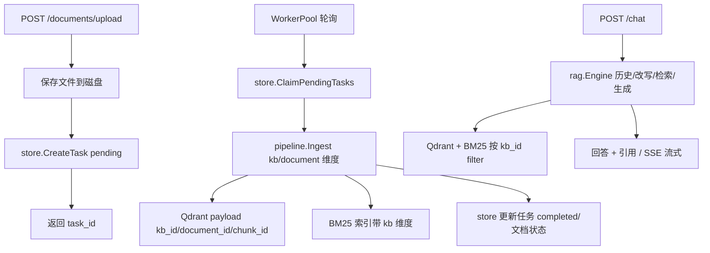

# API 层与知识库管理 Plan

## 架构概览

阶段七引入四个新组件 + 三处既有组件扩展：

1. **cmd/server** — 程序入口：加载配置、初始化 PostgreSQL、装配 worker 与路由、启动 HTTP 服务
2. **internal/api** — HTTP 层（Gin）：路由、Handler、中间件（API Key 认证/日志/CORS/限流）、统一响应、SSE 流式
3. **internal/store** — PostgreSQL 数据访问：知识库 / 文档 / 入库任务 / API Key / 对话历史五张表
4. **internal/task** — 入库任务队列：goroutine worker pool + DB 状态机（pending/processing/completed/failed），失败重试、重启恢复

既有组件扩展：
- **pipeline**：Ingest 增加知识库/文档维度，chunk payload 携带 kb_id / document_id / chunk_id
- **retriever**：BM25 索引记录 chunk 所属 kb，混合检索时按 filter 过滤，保证多知识库不串库
- **config / docker-compose**：新增 server / postgres 配置段与 PostgreSQL 服务

数据流（上传 → 入库 → 问答）：



## 核心数据结构

### KnowledgeBase

```go
type KnowledgeBase struct {
    ID          string
    Name        string
    Description string
    CreatedAt   time.Time
    UpdatedAt   time.Time
}
```

### Document

```go
type Document struct {
    ID        string
    KBID      string
    Filename  string
    Format    string
    Size      int64
    Status    string   // pending / processing / completed / failed
    ChunkIDs  []string // 入库后回填，删除文档时使用
    FilePath  string
    TaskID    string
    CreatedAt time.Time
}
```

### Task

```go
type Task struct {
    ID           string
    KBID         string
    DocumentID   string
    Status       string // pending / processing / completed / failed
    RetryCount   int
    ErrorMessage string
    CreatedAt    time.Time
    UpdatedAt    time.Time
}
```

### APIKey

```go
type APIKey struct {
    ID         string
    Name       string
    KeyHash    string // SHA-256 hex，不存明文
    Enabled    bool
    LastUsedAt *time.Time
    CreatedAt  time.Time
}
```

## 核心接口

### store.Store

```go
// Store PostgreSQL 元数据访问接口
type Store interface {
    // 知识库
    CreateKB(ctx context.Context, kb KnowledgeBase) error
    ListKBs(ctx context.Context) ([]KnowledgeBase, error)
    GetKB(ctx context.Context, id string) (*KnowledgeBase, error)
    UpdateKB(ctx context.Context, kb KnowledgeBase) error
    DeleteKB(ctx context.Context, id string) error
    // 文档
    CreateDocument(ctx context.Context, doc Document) error
    ListDocuments(ctx context.Context, kbID string) ([]Document, error)
    GetDocument(ctx context.Context, id string) (*Document, error)
    UpdateDocumentStatus(ctx context.Context, id string, status string, chunkIDs []string) error
    DeleteDocument(ctx context.Context, id string) error
    // 任务
    CreateTask(ctx context.Context, t Task) error
    GetTask(ctx context.Context, id string) (*Task, error)
    ListTasks(ctx context.Context, kbID string) ([]Task, error)
    UpdateTask(ctx context.Context, t Task) error
    ClaimPendingTasks(ctx context.Context, limit int) ([]Task, error) // 轮询 + 重启恢复共用
    ResetProcessingTasks(ctx context.Context) error                   // 启动时 processing → pending
    // API Key
    CreateAPIKey(ctx context.Context, k APIKey) error
    ListAPIKeys(ctx context.Context) ([]APIKey, error)
    GetAPIKeyByHash(ctx context.Context, hash string) (*APIKey, error)
    SetAPIKeyEnabled(ctx context.Context, id string, enabled bool) error
    DeleteAPIKey(ctx context.Context, id string) error
    TouchAPIKey(ctx context.Context, id string) error // 更新 last_used_at
    // 对话历史（同时实现 rag.HistoryStore 接口）
}
```

### task.WorkerPool

```go
// WorkerPool 入库任务 worker 池
type WorkerPool interface {
    Start(ctx context.Context) // 启动 N 个 worker 轮询任务
    Shutdown()
}
```

### 既有接口扩展

```go
// pipeline：Ingest 增加知识库/文档维度
type IngestRequest struct {
    KBID       string
    DocumentID string
    Reader     io.Reader
    Info       loader.FileInfo
}
Ingest(ctx context.Context, req IngestRequest) error

// retriever：BM25 按知识库过滤（Add 记录 kb、Search 支持 kb filter）
Add(id string, content string, kbID string)
SearchFiltered(query string, topK int, kbID string) []BM25Result
```

## 模块设计

### cmd/server/main.go

**职责：** 装配入口
**对外接口：** main
**依赖：** config / store / task / api

启动顺序：LoadConfig → store.New + Migrate → apiKey 种子（表空时用 bootstrap key）→ NewWorkerPool.Start → api.NewRouter → HTTP Listen。优雅关停：先停 worker（等当前任务），再关 HTTP。

### internal/store

**职责：** PostgreSQL 数据访问，五张表（knowledge_bases / documents / ingest_tasks / api_keys / chat_history）
**对外接口：** `Store` interface, `NewStore(ctx, dsn) (Store, error)`, `Migrate(ctx) error`
**依赖：** jackc/pgx/v5 (pgxpool)

- 知识库删除：级联删除其文档与任务记录（向量库清理由 handler 负责）
- 对话历史：`chat_history(session_id, role, content, created_at)`，实现 rag.HistoryStore 的 Append/Get/Clear（Get 取最近 limit 条）
- 任务轮询：`ClaimPendingTasks` 用 `FOR UPDATE SKIP LOCKED` 防多 worker 抢同一任务；单实例下用 `UPDATE ... WHERE status='pending' RETURNING` 原子领取

### internal/task

**职责：** 入库任务状态机与并发执行
**对外接口：** `WorkerPool` interface, `NewWorkerPool(cfg, store, pipeline) WorkerPool`
**依赖：** store / pipeline / config

- worker 数默认 2，循环：ClaimPendingTasks(batch) → 逐个置 processing → pipeline.Ingest → completed / failed(记录 error_message)
- 失败自动重试：retry_count < 上限（默认 3）→ 回 pending（带退避），否则 failed
- 手动重试接口：failed → pending（retry_count 清零由 handler 决定）
- 启动恢复：`ResetProcessingTasks` 把 processing 重置为 pending，防重启后悬挂

### internal/api

**职责：** HTTP 层
**对外接口：** `NewRouter(cfg, store, engine, worker, auth) *gin.Engine`
**依赖：** Gin / store / rag.Engine / task

路由：

```
POST   /api/v1/knowledge-bases           创建知识库
GET    /api/v1/knowledge-bases           列表
GET    /api/v1/knowledge-bases/:id       查询
PUT    /api/v1/knowledge-bases/:id       更新
DELETE /api/v1/knowledge-bases/:id       删除（含向量库清理）
POST   /api/v1/documents/upload          multipart 上传（kb_id + file）
GET    /api/v1/documents?kb_id=         文档列表
DELETE /api/v1/documents/:id            删除文档（向量库 + BM25 + 记录）
GET    /api/v1/tasks/:id                任务状态
POST   /api/v1/tasks/:id/retry          手动重试
POST   /api/v1/chat                     问答（Accept: text/event-stream 或 ?stream=1 时 SSE）
GET    /api/v1/chat/history?session_id= 对话历史
POST   /api/v1/api-keys                 创建 Key（返回明文一次，仅存 hash）
GET    /api/v1/api-keys                 列表
DELETE /api/v1/api-keys/:id             删除
POST   /api/v1/api-keys/:id/toggle      启停
```

- **统一响应：** `{code, message, data}`，code=0 成功；错误码按类别（400/401/404/500）
- **SSE：** 复用 rag.StreamEvent 事件模型，Gin 流式写 `event: sources/chunk/done/error`
- **上传：** 限制文件大小（默认 50MB），文件存 `{file_storage_dir}/{kb_id}/{doc_id}.{ext}`，校验扩展名可解析（loader.Registry.Resolve）
- **认证中间件：** `Authorization: Bearer <key>` → SHA-256 → GetAPIKeyByHash → 校验 enabled → TouchAPIKey；`/api/v1/chat/history` 与所有写接口均需认证（认证配置可关，供本地开发）
- 删除知识库：先删其全部文档（向量库按 filter kb_id 查 chunk ids → Delete + BM25 移除），再删记录

### internal/pipeline（扩展）

**职责：** Ingest 携带知识库/文档维度
**变更：** `Ingest(ctx, req IngestRequest)`；VectorRecord payload 增加 `kb_id`、`document_id`、`chunk_id`；返回 `([]string chunkIDs, error)` 供文档记录回填；BM25 `Add(id, content, kbID)`

### internal/retriever/bm25.go（扩展）

**职责：** BM25 多知识库过滤
**变更：** `Add(id, content, kbID)` 记录 docKB 映射；`SearchFiltered(query, topK, kbID)` 过滤结果；defaultRetriever 混合检索时若 Filter 含 `kb_id`，BM25 走 SearchFiltered，向量检索走现有 filter

### internal/vectorstore/qdrant.go

**变更：** 无接口变化；payload 由 pipeline 构造（现有 payload 构造在 pipeline 中，仅加字段）

## 模块交互

```
启动：
main → LoadConfig → store.New + Migrate → seed 默认 API Key
     → task.NewWorkerPool(...).Start(ctx)
     → api.NewRouter(cfg, store, engine, worker) → Run

上传 → 入库：
POST /documents/upload
  → 存文件 → store.CreateDocument(pending) + store.CreateTask(pending)
  → 返回 {task_id, document_id}
WorkerPool 循环：
  → store.ClaimPendingTasks → 置 processing
  → pipeline.Ingest(IngestRequest{kb, doc, reader, info})
  → 成功：completed + 文档回填 chunk_ids
  → 失败：retry_count < 上限 ? 回 pending : failed（记录 error_message）

问答：
POST /chat
  → 普通：rag.Engine.Ask(session, question) → {answer, sources}
  → SSE：rag.Engine.StreamAsk → events → SSE 编码
  → 对话历史：store（rag.HistoryStore 实现）读写

删除文档：
DELETE /documents/:id
  → GetDocument → chunk_ids → vectorstore.Delete + bm25Index.Remove × N
  → store.DeleteDocument
```

依赖方向：`api → store / rag / task`，`task → store / pipeline`，`pipeline → loader / chunker / embedding / vectorstore / retriever(bm25)`，`rag → llm / retriever / store(HistoryStore)`。无环。

## 文件组织

```
cmd/
└── server/
    └── main.go               — 装配入口
internal/
├── api/
│   ├── router.go             — 路由注册
│   ├── middleware.go         — API Key 认证 / 日志 / CORS / 限流
│   ├── response.go           — 统一响应
│   ├── handler_kb.go         — 知识库 CRUD
│   ├── handler_doc.go        — 上传 / 列表 / 删除
│   ├── handler_task.go       — 任务查询 / 重试
│   ├── handler_chat.go       — 问答（普通 + SSE）
│   ├── handler_key.go        — API Key 管理
│   ├── handler_history.go    — 对话历史
│   └── api_test.go           — httptest 端到端
├── store/
│   ├── store.go              — Store 接口 + pgStore + NewStore
│   ├── schema.go             — 建表 SQL + Migrate
│   ├── kb.go                 — 知识库 CRUD
│   ├── document.go           — 文档 CRUD
│   ├── task.go               — 任务 CRUD + ClaimPending + ResetProcessing
│   ├── apikey.go             — API Key CRUD + hash 查询
│   ├── history.go            — 对话历史（实现 rag.HistoryStore）
│   └── store_test.go
├── task/
│   ├── worker.go             — WorkerPool 实现
│   └── worker_test.go
├── pipeline/
│   └── pipeline.go           — 修改：IngestRequest / kb 维度 / 返回 chunkIDs
├── retriever/
│   ├── bm25.go               — 修改：Add 带 kb、SearchFiltered
│   ├── retriever.go          — 修改：混合检索传 kb filter
│   └── types.go              — 修改：BM25Result 不变
├── config/
│   └── config.go             — 修改：+ServerConfig / PostgresConfig
└── rag/
    └── engine.go             — 不变（HistoryStore 由 store 提供实现）
configs/
└── config.yaml               — 修改：+server / postgres 段
docker-compose.yml            — 修改：+postgres 服务
```

## 配置扩展

```go
type PostgresConfig struct {
    DSN string `yaml:"dsn"`
}

type ServerConfig struct {
    Port            int    `yaml:"port"`
    FileStorageDir  string `yaml:"file_storage_dir"`
    UploadMaxSizeMB int    `yaml:"upload_max_size_mb"`
    WorkerCount     int    `yaml:"worker_count"`
    TaskMaxRetries  int    `yaml:"task_max_retries"`
    AuthEnabled     bool   `yaml:"auth_enabled"`
    BootstrapAPIKey string `yaml:"bootstrap_api_key"` // 仅首次启动种子用
    RateLimitQPS    int    `yaml:"rate_limit_qps"`    // 0 表示不限制
}
```

默认值：Port=8080、FileStorageDir=./data/uploads、UploadMaxSizeMB=50、WorkerCount=2、TaskMaxRetries=3、AuthEnabled=true、RateLimitQPS=0。

## 技术决策

| 决策点 | 选择 | 理由 |
|--------|------|------|
| Web 框架 | Gin | 路线图已定，生态成熟 |
| PG 驱动 | jackc/pgx/v5（pgxpool） | 纯 Go、性能好、连接池内建 |
| 元数据模型 | 五张表（kb/document/task/api_key/chat_history） | 职责清晰、可独立演进 |
| 任务调度 | goroutine pool + DB 状态机 | 轻量、状态持久化可恢复；后续换 Asynq 不改业务处理 |
| 任务领取 | `UPDATE ... RETURNING` 原子领取（SKIP LOCKED 语义） | 防多 worker 抢同一任务 |
| 重启恢复 | 启动时 processing → pending | 防悬挂任务 |
| 多库隔离 | 单 collection + payload(kb_id/document_id/chunk_id) + 检索 filter | 与 spec 一致，改动最小 |
| BM25 多库 | 索引记录 chunk 的 kb_id，SearchFiltered 过滤 | 混合检索不串库 |
| 文档删除 | 文档表存 chunk_ids，批量 Remove/Delete | 直接可追溯，无需扫描向量库 |
| 文件存储 | 本地磁盘（kb_id 子目录） | 简单；后续换对象存储仅改 handler |
| 认证 | 静态 API Key + SHA-256 hash 存库 + 启停/最后使用时间 | 简单可管理；预留 kb 绑定扩展 |
| 首启种子 | config bootstrap_api_key（表空时创建） | 免手工插库，种子后从 DB 管理 |
| SSE | 复用 rag.StreamEvent 事件模型，Gin 流式写 | 复用阶段六事件语义 |
| 统一响应 | `{code, message, data}`，code=0 成功 | 前后端约定清晰 |
| 依赖引入 | 新增 gin / pgx 两个直接依赖 | 均为生态标准，与路线图一致 |

## 范围说明

- **Swagger 文档**：spec 未覆盖，本阶段不做；后续按需引入 swaggo（路线图项）
- **对话历史**：Postgres 持久化通过 store 实现 rag.HistoryStore 接口，内存实现保留供测试
