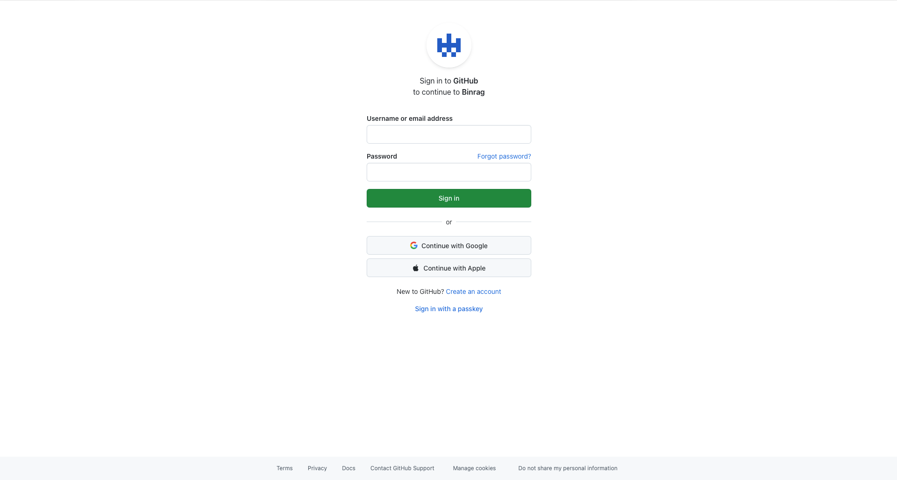

# 登录认证

BinRag 提供**双通道认证**：系统级 API Key 与 OIDC / GitHub 三方登录并存，接口权限严格隔离。

## API Key

- SHA-256 哈希存储，数据库不落明文
- 支持创建 / 启用 / 停用 / 删除，记录最后使用时间
- 系统级 API Key 用于接口访问与系统管理（bootstrap Key 可执行配置修改等管理操作）
- 调用方式：`Authorization: Bearer <api_key>`

## OIDC / GitHub 三方登录

支持任意符合规范的 OIDC Provider 与 GitHub OAuth2，多 Provider 并存，登录后签发**会话 JWT**。

```yaml
oidc:
  enabled: false
  public_url: "https://rag.example.com"        # 外部可访问基址（拼回调地址）
  jwt_secret: ""                                # 会话 JWT 密钥（留空 = 启动时随机生成）
  jwt_expire_minutes: 1200                      # 会话有效期（分钟）
  providers:
    # GitHub（OAuth2 适配；name 固定为 github）
    - name: github
      type: oauth2
      display_name: GitHub
      client_id: ""
      client_secret: ""
    # 自定义 OIDC Provider
    # - name: company
    #   type: oidc
    #   display_name: 公司 SSO
    #   client_id: ""
    #   client_secret: ""
    #   issuer: "https://sso.company.com"
```

> **回调地址**需在各 Provider 后台登记：
> - OIDC：`<public_url>/api/v1/auth/oidc/{name}/callback`
> - GitHub：`<public_url>/api/v1/auth/github/callback`

启用后：`public_url` 必填；OIDC Provider 启动时执行 discovery（失败则启动失败）。



<p class="shot-caption">三方登录入口：GitHub / 企业 OIDC 一键授权，登录后签发会话 JWT</p>

## 会话与用户体系

- 登录用户通过 `/api/v1/auth/providers` 获取 Provider 列表，跳转授权后回调，`/exchange` 兑换会话 JWT
- 前端优先携带 JWT，无则回退 API Key；`/api/v1/auth/me` 返回当前身份
- **用户知识库归属**：登录用户创建的知识库归属自己（owner），系统级 Key 不可见用户知识库，用户也不可见他人 / 系统级知识库
- **「我的 MCP」凭据**：绑定登录用户，知识库范围限于自己的知识库（详见 [MCP Server](/guide/mcp)）

## 权限对比

| 身份 | 知识库 | MCP 凭据 | 系统管理 |
|------|--------|----------|----------|
| 系统级 API Key | 全部（含系统级与用户级） | 可配全量权限（bootstrap 授予） | bootstrap Key 可改配置 / 授 MCP 权限 |
| 登录用户 | 仅自己的（owner 隔离） | 自助生成绑定自己的凭据，范围限自己的知识库 | 无（bootstrap 专属） |
