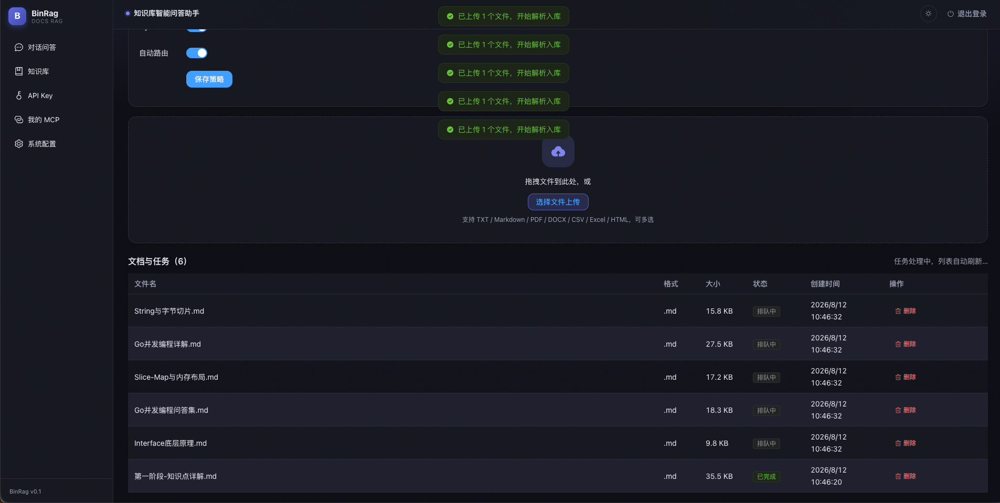
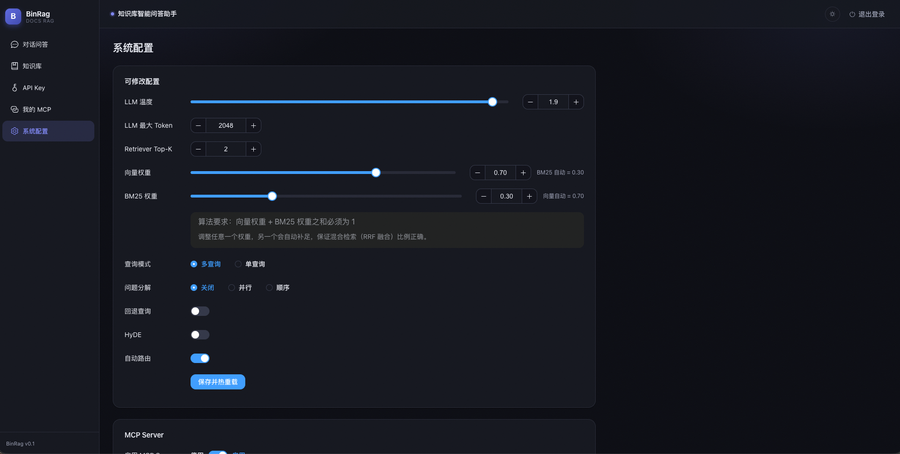
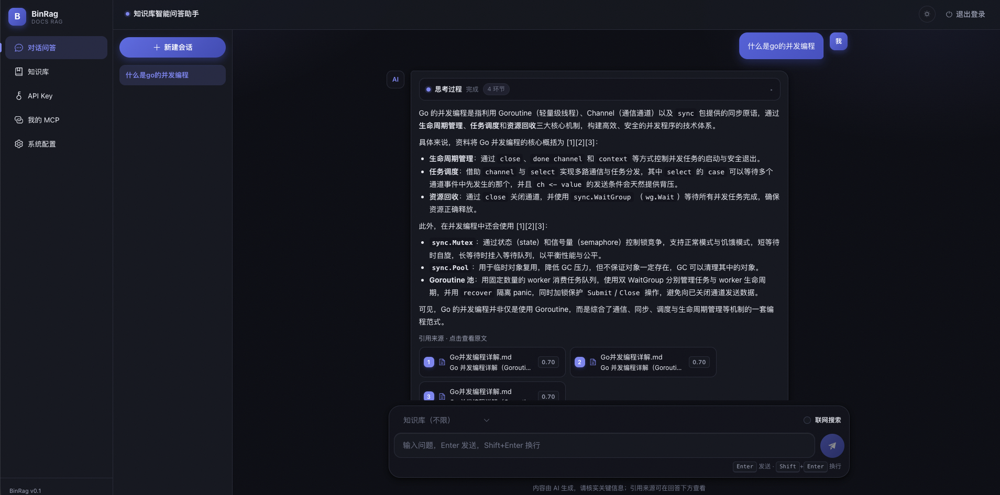

# 核心概念

## 知识库

知识库是文档资产的容器。每个知识库拥有独立的元数据与检索范围：

- **系统级知识库**（owner 为空）：系统级 API Key 可见，用于公共文档
- **用户知识库**（绑定登录用户）：仅创建者可见，天然隔离

单向量集合 + payload 过滤实现检索按知识库范围严格隔离。

## 异步入库

文档上传后不阻塞等待解析，而是进入任务队列：

```
上传 → 任务入队 → worker 池处理：Load → Chunk → Embed → Store
```

- 上传接口立即返回 `task_id`
- 后台 worker 池（并发数可配）执行入库，状态持久化（pending / processing / completed / failed）
- 失败自动重试（次数可配），支持手动重试；服务重启后恢复处理中的任务



<p class="shot-caption">知识库文档上传：选择文件即返回入库任务，后台异步处理</p>

## 检索与重排序

问答与检索均经过三层流水线：

1. **混合检索**：向量语义检索（Qdrant）+ BM25 关键词检索（内存索引），RRF 加权融合——语义理解与精确匹配兼顾
2. **重排序精排**：Cross-encoder 重排序（兼容 Jina / Cohere / bge-reranker 等），对召回结果精排，提升最终质量
3. **知识库过滤**：检索按知识库范围严格过滤，杜绝跨库串扰

融合权重（向量 / BM25）可在「系统配置」中调整（算法要求权重之和为 1）。



<p class="shot-caption">系统配置：混合检索权重、重排序与问答参数均可调优</p>

## RAG 问答编排

```
问题 → Query 改写（消解指代/多查询/分解/回退/HyDE/路由）
     → 混合检索 + 重排序
     → 上下文按 token 预算组装
     → LLM 生成回答并标注引用来源
```

- **Query 改写策略**可配置：多查询 / 问题分解 / 回退 / HyDE / 自动路由
- **引用来源**：回答中的 `[1][2]` 对应召回的文档片段，支持查看来源详情
- **对话历史**：按会话存储，支持多会话上下文
- **流式输出**：SSE 协议，引用来源先行、正文增量返回，前端打字机效果



<p class="shot-caption">流式对话问答：回答带引用来源标注，正文增量返回</p>

## 认证与权限

- **系统级 API Key**：SHA-256 哈希存储，可创建 / 启停 / 删除，用于接口访问与系统管理
- **OIDC / GitHub 登录**：登录用户拥有独立知识库归属，会话 JWT 保护接口
- **MCP 权限**：系统级 Key 可配置 Tool 白名单与知识库范围；用户凭据范围限于自己的知识库

详见 [登录认证](/guide/auth) 与 [MCP Server](/guide/mcp)。
