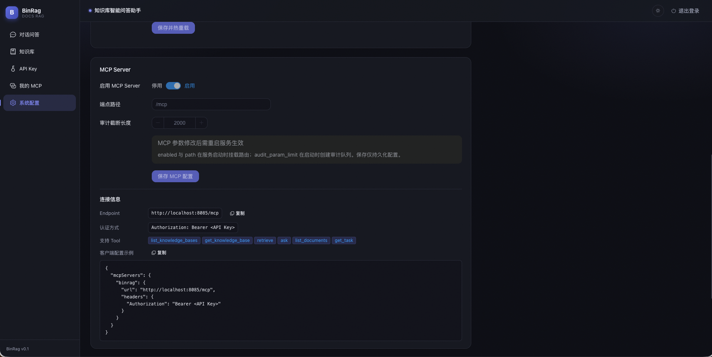

# MCP Server

BinRag 内置 **MCP Server**：基于 MCP 协议（streamable HTTP）向外部平台 / Agent / AI 应用开放**只读 RAG 能力**（问答、检索、知识库与任务查询），与 REST API 同进程部署、复用同一套认证与权限体系。

## 配置

```yaml
server:
  mcp:
    enabled: false          # 默认关闭，显式开启后才挂载 /mcp
    path: "/mcp"            # MCP 端点路径
    audit_param_limit: 2000 # 审计参数截断长度（字符）
```

> `enabled` / `path` 影响路由挂载，修改后**需重启生效**；全局开关可在「系统配置 → MCP Server」中由 bootstrap API Key 修改。

## 认证与授权

- **认证**：`Authorization: Bearer <API Key>`（SHA-256 校验）；缺失 / 无效 / 停用 Key → **HTTP 401**
- **授权**：Tool 白名单外 / 知识库越权 / 任务越权 → JSON-RPC error **-32001**（越权与不存在统一消息，不泄露资源存在性）
- **双层开关**：
  - 全局 `mcp.enabled`（部署级，bootstrap 管理，决定 `/mcp` 是否挂载）
  - 用户级开关（用户控制自己的凭据是否启用）
- **权限模型**：
  - 系统级 API Key（owner 为空）：可配置全量权限，由 bootstrap 管理
  - 登录用户：在「我的 MCP」页自助生成**绑定自己的凭据**，知识库范围**限于自己的知识库**（`scope=all` 也只检索自己的知识库）

## 提供的 Tool（只读）

| Tool | 说明 |
|------|------|
| `list_knowledge_bases` | 列出当前凭据可访问的知识库 |
| `get_knowledge_base` | 知识库详情（无权限按不存在处理） |
| `retrieve` | 纯检索：召回 chunk 与来源（含 filename / kb_id） |
| `ask` | RAG 问答：返回回答与引用来源（不暴露内部推理） |
| `list_documents` | 知识库内文档列表 |
| `get_task` | 入库任务状态（按任务所属知识库校验权限） |

## 客户端接入

支持 streamable HTTP 的 MCP 客户端（Claude Desktop、Cursor、自研 Agent 等）均可接入：

```json
{
  "mcpServers": {
    "binrag": {
      "url": "http://localhost:8085/mcp",
      "headers": { "Authorization": "Bearer <API Key>" }
    }
  }
}
```

标准握手流程：`initialize` → `tools/list` → `tools/call`。

## 用户维度凭据（「我的 MCP」）

登录用户可在 Web 界面「我的 MCP」页（`/my-mcp`）自助管理：

- **生成凭据**：一键生成绑定当前账号的 MCP 访问 Key（明文仅展示一次）；每用户至多一个，重复生成返回 409
- **启用 / 停用**：用户级开关，停用后该凭据的 MCP 调用被拒绝（401）
- **吊销**：删除凭据，立即失效
- **权限配置**：Tool 白名单（6 个）+ 知识库范围（可选项 = 自己的知识库）
- **连接信息**：endpoint 与 `mcpServers` 客户端示例，一键复制



<p class="shot-caption">「我的 MCP」：自助生成绑定用户的凭据，配置 Tool 白名单与知识库范围</p>

## REST 管理接口

| 方法 | 路径 | 说明 |
|------|------|------|
| PUT | `/api/v1/api-keys/:id/permissions` | 更新系统级 Key 的 MCP 权限（bootstrap-only） |
| GET | `/api/v1/mcp/my/status` | 我的 MCP 状态（全局开关 + 我的凭据） |
| POST / DELETE | `/api/v1/mcp/my/key` | 生成（明文仅一次）/ 吊销我的凭据 |
| POST | `/api/v1/mcp/my/key/toggle` | 启用 / 停用我的凭据 |
| PUT | `/api/v1/mcp/my/key/permissions` | 配置我的权限（知识库限自己的） |
