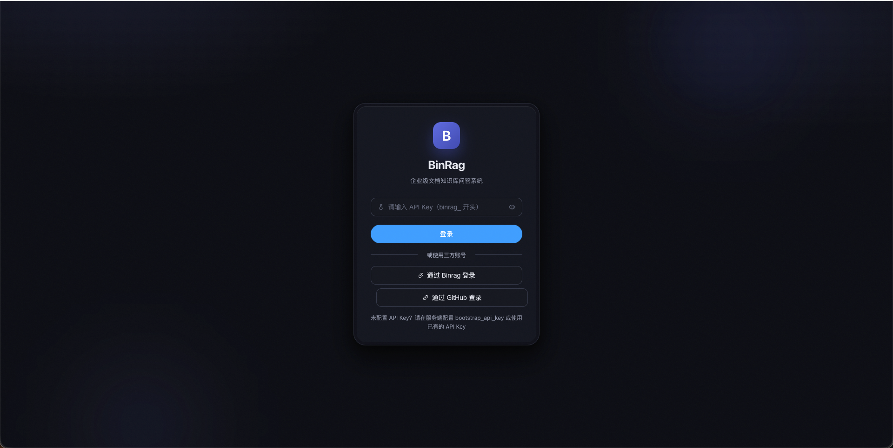

# 核心能力

  <FeatureCard icon="doc" title="多格式解析" desc="TXT / Markdown / PDF / DOCX / CSV / Excel / HTML，统一结构化后入库" />
  <FeatureCard icon="layers" title="混合检索" desc="向量语义 + BM25 关键词，RRF 加权融合，兼顾理解与精确" />
  <FeatureCard icon="filter" title="重排序精排" desc="Cross-encoder 重排序（Jina / Cohere / bge-reranker），提升最终召回质量" />
  <FeatureCard icon="bolt" title="流式问答" desc="SSE 流式输出，引用来源先行、正文增量返回" />
  <FeatureCard icon="task" title="异步入库" desc="上传即返回任务 ID，后台 worker 池执行，失败自动/手动重试" />
  <FeatureCard icon="lock" title="双通道认证" desc="API Key（SHA-256）+ OIDC / GitHub 三方登录，会话 JWT" />
  <FeatureCard icon="mcp" title="MCP Server" desc="streamable HTTP 开放 6 个只读 Tool，外部 Agent 直接调用" />
  <FeatureCard icon="desktop" title="Web + 桌面" desc="浏览器即用；Wails 打包 macOS 安装包，同一套前端" />

# 架构一览

<ArchitectureDiagram />

# 能力亮点

  <HighlightBlock
    badge="MCP Server"
    title="让 RAG 能力被任意 Agent 调用"
    :points="[
      'streamable HTTP 单端点，initialize → tools/list → tools/call 标准握手',
      'API Key 认证（401）与 Tool / 知识库授权（-32001），不泄露资源存在性',
      '系统级 Key 全量权限；登录用户在「我的 MCP」自助生成绑定自己的凭据',
      '双层开关：全局部署级 + 用户级，调用审计异步落库',
    ]"
  />
  <HighlightBlock
    badge="OIDC 登录"
    title="企业级身份接入"
    :points="[
      '任意符合规范的 OIDC Provider + GitHub OAuth2，多 Provider 并存',
      '登录后签发会话 JWT，用户拥有独立的知识库归属',
      '「我的 MCP」凭据绑定登录用户，知识库范围限于自己的知识库',
      '与系统级 API Key 双通道并存，接口权限严格隔离',
    ]"
  />

# 快速上手

<Steps :steps="[
  { title: '配置模型与密钥', desc: 'deploy/configs/config.docker.yaml 填入 Embedding / LLM 模型地址与 bootstrap API Key' },
  { title: '一键 Docker 启动', desc: 'docker compose up -d --build — 构建镜像并启动 PostgreSQL + Qdrant + binrag-server' },
  { title: '浏览器访问 8085', desc: 'http://localhost:8085 — 输入 API Key 登录使用（免编译可拉取 ghcr.io 镜像）' },
]" />

# 运行截图

直观感受 BinRag 的实际运行界面——从知识库管理、文档异步入库，到流式问答与检索调优：

各界面背后的原理与配置，见 [核心概念](/guide/concepts)、[MCP Server](/guide/mcp) 与 [登录认证](/guide/auth)。

---

## 技术栈

<Badge type="info" text="Go 1.26" /> <Badge type="info" text="Gin" /> <Badge type="info" text="Qdrant" /> <Badge type="info" text="PostgreSQL" /> <Badge type="info" text="Vue 3" /> <Badge type="info" text="Wails v3" /> <Badge type="info" text="MCP (streamable HTTP)" />

前往 [快速开始](/guide/getting-started) 开始使用，或查阅 [MCP Server](/guide/mcp) 与 [登录认证](/guide/auth) 专项文档。

